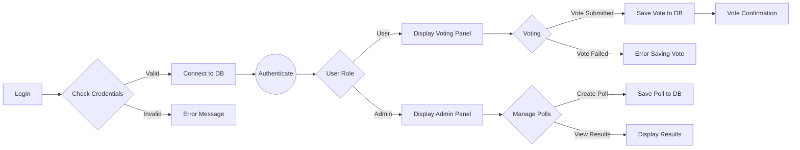
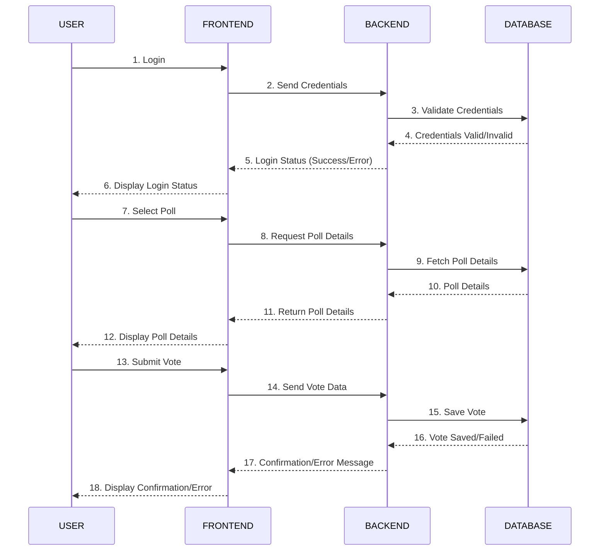

# Dokumentacja inżynierii wymagań

## Członkowie zespołu

- [Miyagi](https://github.com/Patr0sss) - Project Manager, FrontEnd Developer  
- [Paweł](https://github.com/pawel-rus) - Database Administrator, README Specialist
- [Karo(L)](https://github.com/kslowiak) - Backend Developer
- [Piotr](https://github.com/ptrthecat) - Backend Developer

## 1. Macierz kompetencji zespołu

| Kompetencje | Krystian | Paweł | Karol | Piotr |
| ----------- | -------- |----------|----------|-------|
| Bazy Danych SQL | ✅ | ✅ | ❌ | ❌ |
| Bazy Danych NoSQL | ✅ | ✅ | ❌ | ❌ |
| React TS | ✅ | ❌ | ❌ | ❌ |
| Znajomość Flask / Django | ✅ | ❌ | ❌ | ✅ |
| Znajomość Java | ❌ | ✅ | ✅ | ✅ |
| Znajomość Node.js, Express.js | ✅ | ❌ | ✅ | ❌ |
| Testowanie| ❌ | ❌ | ✅ | ✅ |
| Postman  | ✅ | ❌ | ✅ | ❌ |
| Project Management| ✅ | ❌ | ❌ | ❌ | 
| Docker | ❌ | ✅ | ❌ | ❌ | 

## 2. Zestaw pytań 

| Pytanie | Odpowiedź | Uwagi |
|----------|----------|----------|
| Jaka ma to być aplikacja? Webowa czy Desktopowa? | Webowa | - |
| Jaka będzie liczba użytkowników? | <1k | - |
| Z logowaniem? | Tak | Login - hasło |
| Głosowanie jawne czy tajne? | Jawne | Widać kto oddał głos. |
| Czy ma być statystyka na żywo? | Tak | - |
| Jaka rola admina? | Tworzenie ankiet/głosowań. Dostęp do raportów | - |
| Hosting? | Lokalnie | - |
| Jaki interfejs użytkownika? | GUI | Funkcjonalny, przejrzysty, ładny. |
| Czy admin ma mieć dostęp do raportów o wynikach głosowań? | Tak. | Raport ten będzie zawierał wykres, który wizualizuje wyniki głosowania w zależności od czasu oddania głosów. Dzięki temu administratorzy będą mogli analizować, jak głosy były oddawane w trakcie trwania ankiety |

## 3. Ustalony format danych wejściowych

### Struktura bazy danych:

### Tabela: `users`:

| Kolumna       | Typ danych     | Opis                                              |
| ------------- | -------------- | ------------------------------------------------- |
| `id`          | `INT`          | Unikalny identyfikator użytkownika (klucz główny) |
| `username`    | `VARCHAR(50)`  | Nazwa użytkownika                                 |
| `password`    | `VARCHAR(255)` | Hash hasła                                        |
| `email`       | `VARCHAR(100)` | Firmowy email użytkownika                         |
| `role`        | `VARCHAR(10)`  | Rola użytkownika (`admin` albo `user`)            |

### Tabela: `polls` :

| Kolumna        | Typ danych     | Opis                                               |
| -------------- | -------------- | -------------------------------------------------- |
| `id`           | `INT`          | Unikalny identyfikator ankiety (klucz główny)      |
| `title`        | `VARCHAR(255)` | Tytuł ankiety                                      |
| `description`  | `TEXT`         | Opis ankiety                                       |
| `scale`        | `varchar(50)`  | Skala ocen (np. 0-5, 1-5, 1-10)                    |
| `opens_at`     | `TIMESTAMP`    | Data i czas otwarcia ankiety                       |
| `expires_at`   | `TIMESTAMP`    | Data i czas zakończenia ankiety                    |

### Tabela: `votes` :

| Kolumna        | Typ danych     | Opis                                               |
| -------------- | -------------- | -------------------------------------------------- |
| `id`           | `INT`          | Unikalny identyfikator głosu (klucz główny)        |
| `poll_id`      | `INT`          | ID ankiety, na którą oddano głos (klucz obcy)      |
| `username`     | `INT`          | username użytkownika, który oddał głos             |
| `vote_value`   | `INT`          | Wartość oddanego głosu w ustalonej skali           |
| `voted_at`     | `TIMESTAMP`    | Data i czas oddania głosu                          |

### Tabela: `results` :

| Kolumna        | Typ danych     | Opis                                               |
| -------------- | -------------- | -------------------------------------------------- |
| `poll_id`      | `INT`          | ID ankiety (klucz główny i obcy)                   |
| `average_vote` | `FLOAT`        | Średnia ocena oddana w ankiecie                    |
| `votes_count`  | `INT`          | Liczba głosów oddanych na dany projekt             |

### Przykład danych wejściowych

Poniżej przedstawiono przykłady danych zgodnych z ustaloną strukturą bazy danych.

#### Tabela: `users`

| id  | username   | password                           | email                | role  |
| --- | ---------- | ---------------------------------- | -------------------- | ----- |
| 1   | admin      | $2y$10$abcdefghijkmnopqrstuvwxyz   | admin@example.com    | admin |
| 2   | jsmith     | $2y$10$lmnopqrstuvwxyzabcdefghijk  | jsmith@example.com   | user  |
| 3   | amiller    | $2y$10$zxywvutsrqponmlkjihgfedcba  | amiller@example.com  | user  |

#### Tabela: `polls`

| id  | title                 | description                                      | scale | opens_at            | expires_at          |
| --- | --------------------- | ------------------------------------------------ | ----- | ------------------- | ------------------- |
| 1   | Project XYZ           | Ocena projektu według skali 1-5                  | 1-5   | 2024-10-01 09:00:00 | 2024-10-10 17:00:00 |
| 2   | Project ZYX           | Podsumowanie wyników sprintu według skali 0-5    | 0-5   | 2024-10-05 10:00:00 | 2024-10-15 18:00:00 |

#### Tabela: `votes`

| id  | poll_id | user_id | vote_value | voted_at             |
| --- | ------- | ------- | ---------- | -------------------- |
| 1   | 1       | 2       | 4          | 2024-10-02 09:15:00  |
| 2   | 1       | 3       | 5          | 2024-10-03 14:20:00  |
| 3   | 2       | 2       | 3          | 2024-10-06 11:30:00  |

#### Tabela: `results`

| poll_id | average_vote | votes_count |
| ------- | ------------ | ----------- |
| 1       | 4.5           | 2            |
| 2       | 3.0           | 1            |

## 4. Diagram przypadków użycia

## 5. Diagram sekwencyjny UML: 

### 6. Sugerowany Stack technologiczny :

    
     
     

#### Uzasadnienie wyboru technologii

**React**
- Jest doskonałym narzędziem do budowania interaktywnych interfejsów użytkownika, co pozwala na płynne doświadczenia dla użytkowników aplikacji webowej. 

**Node.js**
- Działa na architekturze zdarzeniowej, co pozwala na obsługę wielu jednoczesnych połączeń, idealne do aplikacji wymagających dużej wydajności.
- Użycie JavaScript zarówno po stronie klienta, jak i serwera upraszcza procesy rozwoju i umożliwia zespołowi większą elastyczność w pracy. Programiści mogą łatwiej przechodzić między front-endem a back-endem.

**PostgreSQL**
- To potężna relacyjna baza danych, która obsługuje dużą ilość danych, zapewniając wysoką wydajność i wsparcie dla zaawansowanych funkcji.
