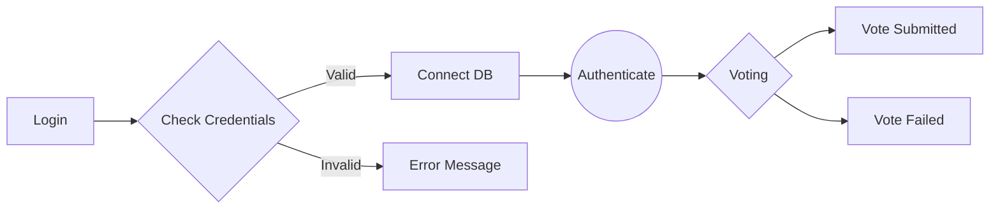
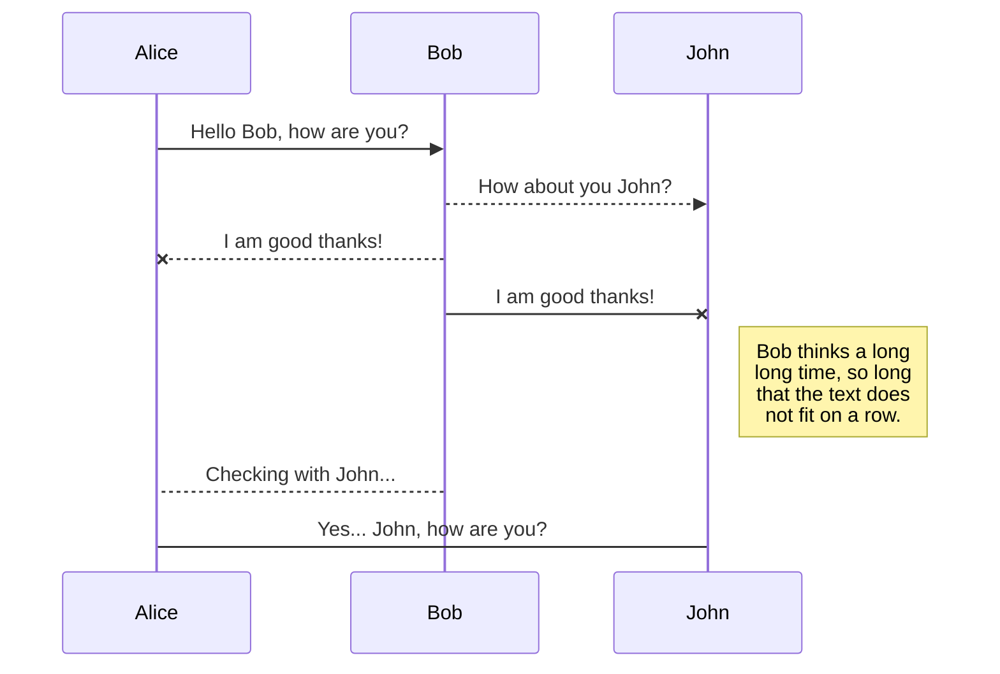

# Dokumentacja inżynierii wymagań

## Członkowie zespołu
### 1. Macierz kompetencji zespołu
| Kompetencje | Krystian | Paweł | Karol | Kondzioła |
| ----------- | -------- |----------|----------|-------|
| React TS | ✅ | ❌ | ❌ |❌ |
| Bazy Danych| ❌ | ✅ | ❌ |❌ |
| Backend| ✅ | ✅ | ❌ |❌ |
| Testowanie| ❌ | ❌ | ❌ |❌ |
| Project Management| ✅ | ❌ | ❌ |✅ | 

### 2. Zestaw pytań 

| Pytanie | Odpowiedź | Uwagi |
|----------|----------|----------|
| Jaka ma to być aplikacja? Webowa czy Desktopowa? | Webowa | - |
| Jaka będzie liczba użytkowników? | <1k | - |
| Z logowaniem? | Tak | Login - hasło |
| Głosowanie jawne czy tajne? | Jawne | - |
| Czy ma być statystyka na żywo? | Tak | - |
| Jaka rola admina? | Tworzenie ankiet/głosowań. Dostęp do raportów | - |
| Hosting? | Lokalnie | - |
| Jaki interfejs użytkownika? | GUI | Funkcjonalny, przejrzysty, ładny |

### 3. Ustalony format danych wejściowych

| X | X | X | X |
|--|--|--|--|

### 7. Stack technologiczny
 - React
 - Node.js
 - 

## UML diagrams

You can render UML diagrams using [Mermaid](https://mermaidjs.github.io/). For example, this will produce a sequence diagram:

